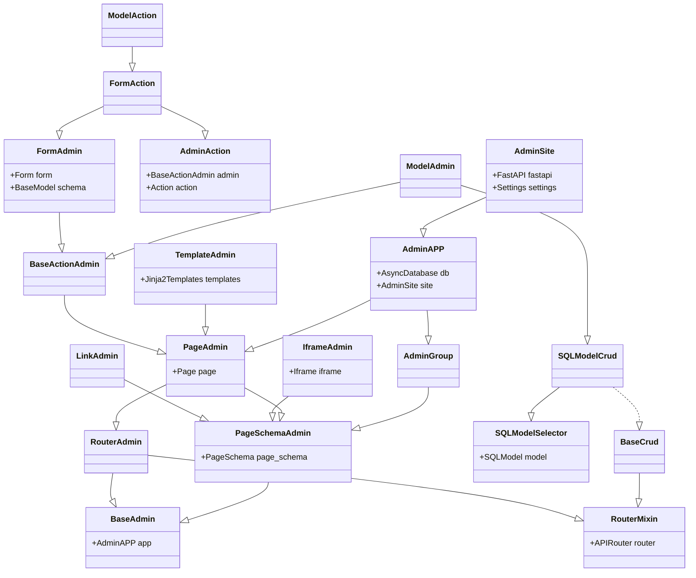
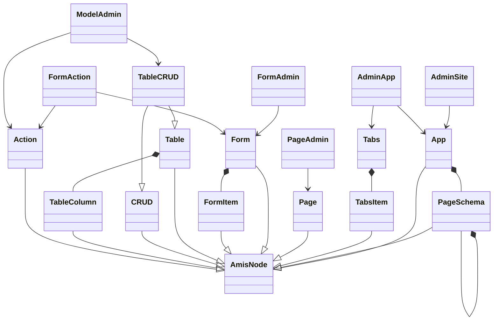

## BaseAdmin

- Page management base class

### fields

#### app

The application `AdminApp` object registered by the current admin object.

- Note that `app` is not the top level and may be registered by other `AdminApp` or `AdminSite`.)

#### site

The `AdminSite` site where the current management object is registered, the top-level Admin object.

#### unique_id

The unique ID of the current management object.

- Customizable settings, if not set, it will be automatically generated according to the default rules.
- Unique IDs should not change when a project is started or stopped, and should be unique per Admin class within a project.

## Admin ClassDiagram

- FastAPI-Amis-Admin core class diagram

## Admin & Amis

- fastapi-amis-admin class and amis component class diagram

