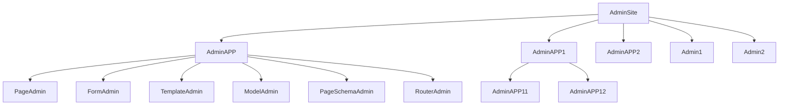

# Management Application

The management application is designed for more complex scenarios, the functional modules are isolated from each other, but can be easily and freely combined.

# # Management site architecture

The management application is a larger management class, and the management site is a larger management application. Management application can be composed of multiple management classes or management sub-applications, their previous relationship is similar to the following figure:



## Features of AdminAPP

- AdminAPP is also an administrative class, which can be registered to other administrative applications or administrative sites.

- An administrative application can register other administrative classes to its own application object.

- Each managed application can be configured with a separate database connection.

## Configuring a standalone database engine

```python
from sqlalchemy.ext.asyncio import create_async_engine


@site.register_admin
class BlogApp(admin.AdminApp):
    page_schema = PageSchema(label='blog app', icon='fa fa-wordpress')
    router_prefix = '/blog'
    # Configure custom database engine
    engine = create_async_engine('sqlite+aiosqlite:///amisadmin.db', future=True)

    def __init__(self, app: "AdminApp"):
        super(). __init__(app)
        # Register the admin page under this application;
        self.register_admin(ArticleAdmin, CategoryAdmin)

```

## Special Usage

The admin application can be used as a mini version of the admin site, used to group administrative categories.

```python
@site.register_admin
class DocsAdminGroup(AdminApp):
    # display mode, supports 9 modes: 'line,card,radio,vertical,chrome,simple,strong,tiled,sidebar'
    # Display effect reference: https://aisuda.bce.baidu.com/amis/zh-CN/components/tabs#%E5%B1%95%E7%A4%BA%E6%A8%A1%E5%BC%8F
    # Default is: None, use menu grouping to display.
    tabs_mode = amis.TabsModeEnum.vertical

    def __init__(self, app: "AdminApp"):
        super(). __init__(app)
        self.register_admin(HomeAdmin, DocsAdmin, ReDocsAdmin)
```

## More Uses

The tutorials and examples for `AdminApp` are not perfect at the moment, more rich features and tutorials may be added later.
If you just want to implement a specific feature and don't want to delve into it, you can skip this part first.
Alternatively, you can read the sample application or the source code to learn more.

- [`FastAPI-Amis-Admin-Demo`](https://github.com/amisadmin/fastapi_amis_admin_demo): A sample `FastAPI-Amis-Admin` application.
- [`FastAPI-User-Auth-Demo`](https://github.com/amisadmin/fastapi_user_auth_demo): A `FastAPI-User-Auth` application example.


