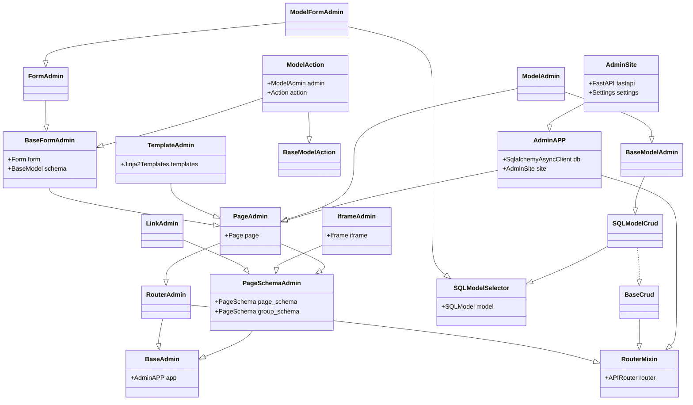
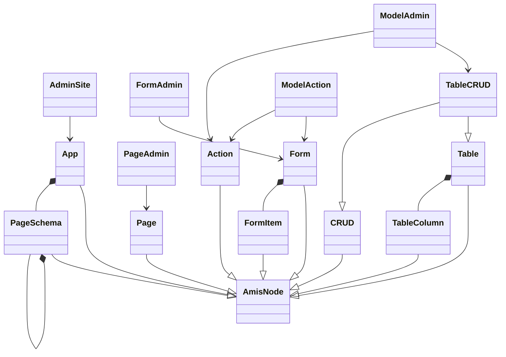

## BaseAdmin

- 页面管理基类

### 字段

#### app

- 当前管理对象注册的应用(站点)

## Admin ClassDiagram

- FastAPI-Amis-Admin 核心类图

``` mermaid
classDiagram
	%% admin
    class RouterMixin
    RouterMixin: +APIRouter router
    RouterAdmin --|> RouterMixin
    class BaseAdmin
    BaseAdmin: +AdminAPP app
    RouterAdmin --|> BaseAdmin
    PageSchemaAdmin --|> BaseAdmin
    PageSchemaAdmin: +PageSchema page_schema
    PageSchemaAdmin: +PageSchema group_schema
    
    LinkAdmin --|> PageSchemaAdmin
    IframeAdmin --|> PageSchemaAdmin
    IframeAdmin: +Iframe iframe
    
    PageAdmin --|> PageSchemaAdmin
    PageAdmin --|> RouterAdmin
    PageAdmin: +Page page
    
    BaseFormAdmin --|> PageAdmin
    BaseFormAdmin: +Form form
    BaseFormAdmin: +BaseModel schema
    
    FormAdmin --|> BaseFormAdmin
    
    TemplateAdmin --|> PageAdmin
    TemplateAdmin: +Jinja2Templates templates
    
    %% model
    ModelFormAdmin --|> FormAdmin
    ModelFormAdmin --|> SQLModelSelector
    ModelAction --|> BaseFormAdmin
    ModelAction --|> BaseModelAction
    ModelAction: +ModelAdmin admin
    ModelAction: +Action action
    
    class SQLModelSelector
    SQLModelSelector: +SQLModel model
    BaseCrud --|> RouterMixin
    SQLModelCrud ..|> BaseCrud
    SQLModelCrud --|> SQLModelSelector
    
    BaseModelAdmin --|> SQLModelCrud
    ModelAdmin --|> BaseModelAdmin
	ModelAdmin --|> PageAdmin
	%% app
    AdminAPP --|> RouterMixin
    AdminAPP --|> PageAdmin
    AdminAPP: +SqlalchemyAsyncClient db
    AdminAPP: +AdminSite site
    
    AdminSite --|> AdminAPP
    AdminSite: +FastAPI fastapi
    AdminSite: +Settings settings
    
```

## Admin & Amis

- fastapi-amis-admin类与amis组件类关系图

```mermaid
classDiagram
AdminSite --> App
App --|> AmisNode
App *-- PageSchema
PageSchema --|> AmisNode
PageSchema *-- PageSchema

Page --|> AmisNode
PageAdmin --> Page

Form --|> AmisNode
FormItem --|> AmisNode
Form *-- FormItem
FormAdmin --> Form

Table --|> AmisNode
CRUD --|> AmisNode
TableCRUD --|> Table
TableCRUD --|> CRUD
Table *-- TableColumn
TableColumn --|> AmisNode
Action --|> AmisNode
ModelAction --> Form
ModelAction --> Action
ModelAdmin --> TableCRUD
ModelAdmin --> Action

```
