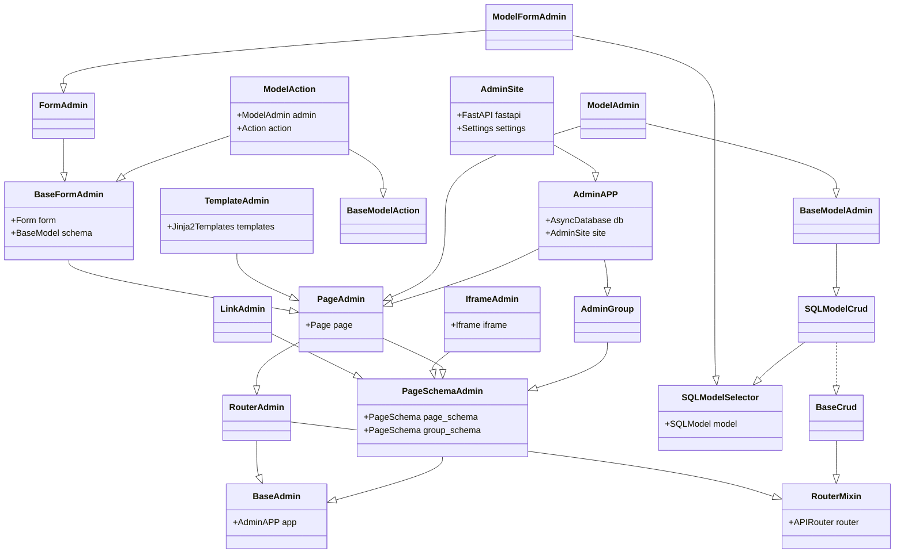
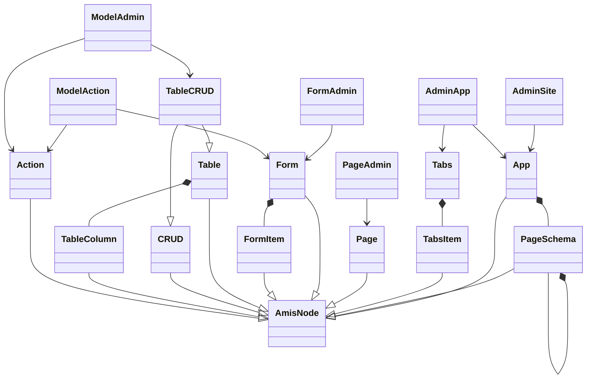

## BaseAdmin

- 页面管理基类

### 字段

#### app

当前管理对象注册的应用`AdminApp`对象.

- 注意`app`并非最顶级,还可能被其他`AdminApp`或`AdminSite`注册.)

#### site

当前管理对象注册的站点`AdminSite`站点,最顶级Admin对象.

#### unique_id

当前管理对象的唯一性标识ID.

- 可自定义设置,如未设置则根据默认规则自动生成.
- 唯一性标识ID不应当随着项目的启动或停止产生变化, 并且在项目中每个Admin类标识应当唯一.

## Admin ClassDiagram

- FastAPI-Amis-Admin 核心类图

## Admin & Amis

- fastapi-amis-admin类与amis组件类关系图

