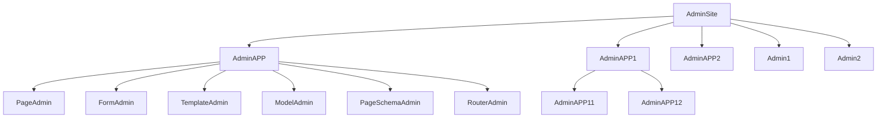

# 管理应用

管理应用的设计是为了针对更加复杂的场景,将各个功能模块相互隔离,但是又能方便的自由组合.

## 管理站点架构

管理应用是一个更大的管理类,而管理站点是一个更大的管理应用.管理应用可以由多个管理类或管理子应用组成,它们之前的关系类似下图:

## 管理应用的特性

- 管理应用也是一个管理类,它可以被注册到其他管理应用或管理站点.

- 管理应用可以注册其他管理类到本身的应用对象.

- 每个管理应用都可以配置独立的数据库连接.

  

## 更多用法

目前关于`AdminApp`的教程与示例并不完善,后续可能会添加更多丰富的功能与教程,如果你仅仅是想实现特定的功能,并不想深入研究,这部分可以先行跳过.

### 相关文档

- [AdminApp - FastAPI-Amis-Admin](/amis_admin/AdminApp/)

- [fastapi_amis_admin/site.py](https://github.com/amisadmin/fastapi_amis_admin/blob/master/fastapi_amis_admin/amis_admin/site.py)