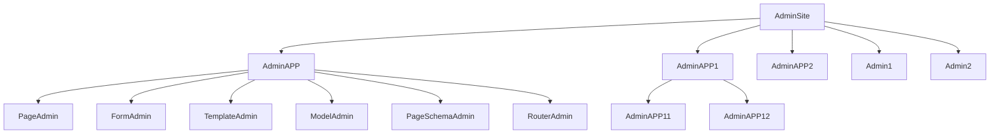

# 管理应用

管理应用的设计是为了针对更加复杂的场景,将各个功能模块相互隔离,但是又能方便的自由组合.

## 管理站点架构

管理应用是一个更大的管理类,而管理站点是一个更大的管理应用.管理应用可以由多个管理类或管理子应用组成,它们之前的关系类似下图:



## 管理应用的特性

- 管理应用也是一个管理类,它可以被注册到其他管理应用或管理站点.

- 管理应用可以注册其他管理类到本身的应用对象.

- 每个管理应用都可以配置独立的数据库连接.

## 配置独立数据库引擎

```python
from sqlalchemy.ext.asyncio import create_async_engine


@site.register_admin
class BlogApp(admin.AdminApp):
    page_schema = PageSchema(label='博客应用', icon='fa fa-wordpress')
    router_prefix = '/blog'
    # 配置自定义数据库引擎
    engine = create_async_engine('sqlite+aiosqlite:///amisadmin.db', future=True)

    def __init__(self, app: "AdminApp"):
        super().__init__(app)
        # 注册管理页面到此应用下;
        self.register_admin(ArticleAdmin, CategoryAdmin)

```

## 特殊用法

管理应用可以做为一个迷你版的管理站点,用来给管理类分组.

```python
@site.register_admin
class DocsAdminGroup(AdminApp):
    # 展示模式,支持9种模式:'line,card,radio,vertical,chrome,simple,strong,tiled,sidebar'
    # 展示效果参考: https://aisuda.bce.baidu.com/amis/zh-CN/components/tabs#%E5%B1%95%E7%A4%BA%E6%A8%A1%E5%BC%8F
    # 默认为:None,采用菜单分组形式展示.
    tabs_mode = amis.TabsModeEnum.vertical

    def __init__(self, app: "AdminApp"):
        super().__init__(app)
        self.register_admin(HomeAdmin, DocsAdmin, ReDocsAdmin)
```

## 更多用法

目前关于`AdminApp`的教程与示例并不完善,后续可能会添加更多丰富的功能与教程.
如果你仅仅是想实现特定的功能,并不想深入研究,这部分可以先行跳过.
此外,你也可以通过阅读示例程序或源代码进一步了解.

- [`FastAPI-Amis-Admin-Demo`](https://github.com/amisadmin/fastapi_amis_admin_demo):  一个`FastAPI-Amis-Admin` 应用程序示例.
- [`FastAPI-User-Auth-Demo`](https://github.com/amisadmin/fastapi_user_auth_demo): 一个`FastAPI-User-Auth` 应用程序示例.


